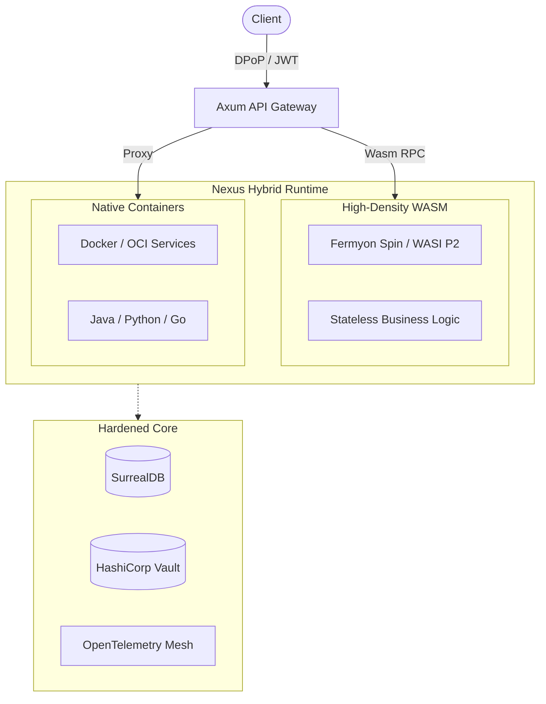

# 💠 Nexus

> **Next-Generation Distributed Framework for Ephemeral, High-Density Computing.**


**Nexus** is a high-performance distributed backend framework designed for the transition from heavyweight
containerization to granular, secure execution paradigms. It provides a unified **Hybrid Runtime** that orchestrates
traditional OCI containers (Docker) alongside ultra-lightweight **WebAssembly (WASI P2)** components

---

## 🌟 The Core Proposition

Nexus addresses "infrastructure fatigue" by offering a platform where security, networking, and persistence are handled
by a hardened native gateway, while business logic resides in isolated, scale-to-zero sandboxes.

### 🚀 Hybrid Execution Model

Nexus is not "WASM-only". It is a bridge for enterprise migration:

* **WASM Layer:** For high-density, ephemeral tasks with microsecond cold starts.
* **Container Layer:** For legacy services (Java, Python, Go) or heavy stateful workloads.
* **Unified Ingress:** A single Axum-based gateway manages routing, security, and telemetry for both layers
  transparently.

## 📚 [Documentation](docs/articles/README.md)

A deep-dive series of engineering articles exploring the internal design, philosophy, and technical decisions behind the
NEXUS ecosystem.

* 🛠️ **[Building NEXUS (Part 1): Errors as Infrastructure](docs/articles/nx-error/README.md)** — An architectural
  breakdown of why the error-handling system was laid down before any functional runtime logic, exploring
  metadata-centric failure contracts and cross-platform WASM boundaries.
* 🔍 **[Building NEXUS (Part 2): Observability as a Contract](docs/articles/nx-logger/README.md)** — A deep dive into
  building a zero-allocation, schema-enforced logging subsystem designed to eradicate data ingestion drops and bridge
  the gap between sandboxed WebAssembly guests and native microservices.

---

## 🏗 High-Level Architecture

Nexus synthesizes the best of the Rust ecosystem with frontier WASM standards.



---

## 🔒 "Fortress-First" Security & Compliance

Nexus assumes a zero-trust environment. Security is baked into the architecture, not "bolted on" later.

* **Identity Binding (RFC 9449 DPoP):** Prevents token replay attacks. Every JWT must be accompanied by a cryptographic
  signature from the client's private key.
* **JIT Secret Injection:** Secrets are never stored in ENV variables. The gateway fetches credentials from HashiCorp
  Vault and injects them into the WASM sandbox's ephemeral memory only for the duration of the request.
* **Capability-Based Isolation:** WASM components operate in a formal sandbox with zero ambient authority – no file or
  network access unless explicitly granted via WASI.
* **Row-Level Security (RLS):** Built-in SurrealDB graph traversal enforces strict multi-tenant isolation at the data
  layer.

---

## 🛠 Developer Experience: The `cargo x` Engine

Nexus eliminates operational friction through an integrated **Internal Developer Platform (IDP)**:

| Command              | Action                                                           |
|:---------------------|:-----------------------------------------------------------------|
| `cargo setup`        | Installs WASM toolchains and generates cryptographic keys.       |
| `cargo x add <name>` | Scaffolds a new WASI component or Docker service from templates. |
| `cargo dev up`       | Launches the backing stack (Vault, SurrealDB, Redis, OTel).      |
| `cargo codegen`      | Automatically synchronizes WIT bindings and DB migrations.       |
| `cargo serve`        | Starts the hybrid runtime with instant hot-reloading.            |

---

## 📊 Performance & ROI

By moving logic from Docker to WASM, Nexus enables a fundamental shift in cloud economics:

* **Density:** Run **10,000+** components on a single server, compared to ~100 Docker containers.
* **Latency:** Cold starts in < **1ms**, eliminating the "serverless tax."
* **Footprint:** Binary sizes reduced from 500MB+ to < **5MB**.
* **TCO:** Infrastructure cost reduction of up to **80%** for high-scale microservice deployments.

---

## 📁 Workspace Structure

```text
nexus/
├── clients/          # Dioxus-based GUI and CLI clients
├── components/       # WASI P2 stateless business logic (The "WASM" way)
├── services/         # Native microservices & API Gateway (The "Native" way)
├── crates/           # Core SDKs: nx-http, nx-error, nx-database, etc.
├── tooling/          # The `xtask` engine and codegen templates
└── ops/              # Infrastructure-as-Code (Compose, Vault, OTel configs)
```

---

## 📊 Observability Mesh

Nexus integrates a full **OpenTelemetry** stack out-of-the-box. When you run `cargo dev up`, you get:

* **Jaeger:** Distributed tracing across the Gateway, WASM, and Docker layers.
* **Loki:** Centralized log aggregation for ephemeral components.
* **Prometheus:** Real-time metrics for system health and cold-start monitoring.

---

🚀 Getting Started

```bash
git clone https://github.com/AnatoliiShliakhto/nexus.git
cd nexus

# 1. Install required WASM targets and auxiliary tools
cargo setup

# 2. Generate DB migrations and compile components to WASI P2
cargo codegen
cargo dist components

# 3. Compose up the infrastructure stack in Docker
cargo dev up

# 4. Bootstrap the database schema
cargo ops migrate up

# 5. Launch the local Spin development server
cargo serve
```

---

## 📄 License

Dual-licensed under [MIT](LICENSE-MIT) and the [Apache 2.0](LICENSE-APACHE).
