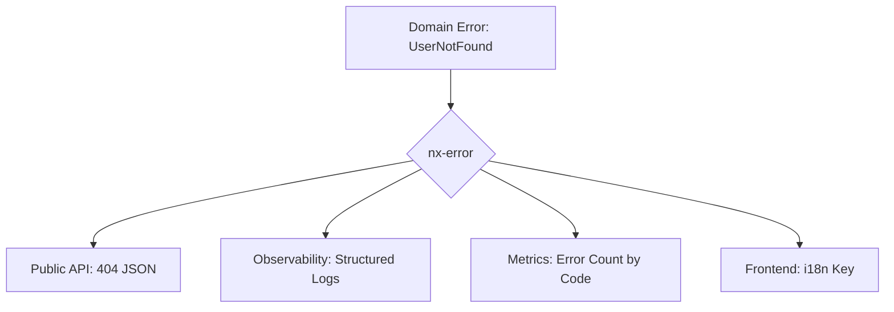

# Errors as Infrastructure: Why the first crate in NEXUS wasn't networking.

## Designing a metadata-centric failure contract for distributed Rust environments.

When people introduce a new Rust project, they usually begin with networking, storage, async orchestration, or protocol
design.

I didn’t.

The first crate I put into **[NEXUS](https://github.com/AnatoliiShliakhto/nexus)** was an error-handling crate: 
[`nx-error`](https://github.com/AnatoliiShliakhto/nexus/tree/dev/crates/error)
(and its companion [`nx-error-macros`](https://github.com/AnatoliiShliakhto/nexus/tree/dev/crates/error-macros)).

That choice was not aesthetic. It was architectural.

NEXUS is built around service boundaries, typed contracts, and execution environments where failures need to be
represented consistently across layers.



This post is the first in a series about the technical foundations of NEXUS. It explains why I built `nx-error`, what
problems it was designed to solve, and which trade-offs mattered most: typed metadata, context separation, predictable
propagation, and WASM-conscious ergonomics.

---

## A quick look at the API

The surface API is intentionally small. The goal was to make domain errors easy to define, but also useful to downstream
systems: HTTP layers, logs, metrics, dashboards, and operators.

```rust
use nx_error::prelude::*;

#[error]
pub enum DatabaseError {
    #[error(message = "Connection lost", status = 503, code = "DB_CONN_LOST")]
    ConnectionLost,

    #[error(message = "Entity not found", status = 404, code = "DB_NOT_FOUND")]
    NotFound,

    #[error(message = "Database IO failure", status = 507, code = "DB_IO_ERROR", source = std::io::Error)]
    Io,
}
```

That error can then be used in ordinary Rust code without custom mapping glue at every callsite:

```rust
fn read_snapshot(path: &str) -> Result<String, DatabaseError> {
    std::fs::read_to_string(path).map_err(DatabaseError::from)
}
```

And when an error needs operational context, it can be enriched where that context actually exists:

```rust
fn read_config() -> Result<String, DatabaseError> {
    let res = std::fs::read_to_string("config.json")
        .with_message("Failed to load configuration")
        .with_help("Check whether config.json exists in the application root")?;

    Ok(res)
}
```

This is the level of ergonomics I wanted: define domain semantics once, preserve source context automatically, and add
diagnostic detail only where it becomes meaningful.

---

## Why existing crates were not enough for this project

Rust already has excellent tools for error handling.

* `thiserror` is an excellent fit for typed library errors.
* `anyhow` is excellent for application-level aggregation and rapid iteration.
* `miette` is great for diagnostics-heavy CLI workflows.

`nx-error` is not an attempt to replace them universally. It exists because NEXUS had a narrower and more demanding set
of constraints.

### 1. Public-safe and operator-grade output needed to be different things

The same failure should not be serialized identically for every audience.

An external client usually needs:

* a stable error code
* a concise message
* a status value

An operator or log pipeline needs:

* the full source chain
* contextual details
* remediation hints
* enough structure for indexing and correlation

That separation had to be a first-class design goal, not something improvised later in an HTTP handler.

### 2. Error transport cost mattered

In Rust, the size of an enum is dictated by its largest variant. That is fine until error variants begin carrying a lot
of inline data: strings, identifiers, nested structures, wrapped sources, and ad hoc context.

In ordinary service code this is often acceptable. In more constrained execution environments, especially WASM-oriented
component boundaries, oversized error payloads become less attractive. They make error values heavier to move and blur
the line between domain semantics and incidental diagnostics.

I wanted a design where rich diagnostics did not automatically imply bloated variant layouts.

### 3. Semantic metadata needed to survive propagation

In a layered system, lower-level code often already knows important semantics:

* this is a `404`, not a `500`
* this is a configuration error, not a business-rule violation
* this is a retryable infrastructure failure, not a client error

I did not want every service layer to restate those semantics manually in handwritten mappers. That approach is
repetitive and, more importantly, a source of drift.

What I wanted was a way to define error meaning once and let it propagate predictably.

---

## The core idea: errors as metadata-bearing contracts

The key design decision in `nx-error` was to treat errors not just as values implementing `std::error::Error`, but as
**structured metadata carriers**.

That metadata is useful to multiple consumers at once:

* the Rust type system
* HTTP response mapping
* frontend i18n/error handling
* logs
* telemetry sinks
* support and operations workflows

At a high level, the design revolves around a metadata model with concepts like:

* status
* machine-readable code
* message
* optional details
* optional help/remediation
* source chaining

That may sound familiar conceptually, but the important part is how it changes engineering behavior. Once those fields
become part of the error contract, developers stop treating errors as opaque strings and start treating them as typed
operational events.

That shift was one of the main goals.

---

## Problem 1: "fat enums" don’t scale well as a system-wide contract

A common pattern in Rust is to attach context directly to enum variants:

```rust
pub enum ServiceError {
    NotFound {
        entity: &'static str,
        id: u64,
        tenant: String,
        trace_id: String,
    },
    DatabaseFailure {
        operation: String,
        table: String,
        source: std::io::Error,
    },
}
```

This is easy to write and often reasonable locally. But there is a structural downside: the enum’s size is determined by
its largest variant. As more inline context accumulates, the error type gets heavier everywhere, even where most of that
payload is irrelevant.

That becomes less attractive when the error type is part of a project-wide contract rather than a private implementation
detail.

The direction I took in `nx-error` was to keep the surface declaration concise while avoiding a design where every
variant becomes a large inline payload carrier. In practice, that means treating rich diagnostic context as attached
metadata rather than requiring each variant to own an ever-growing set of fields directly.

The goal was not to make errors "tiny at all costs." It was more specific: preserve strong typing at the enum level
without forcing every layer to pay for maximal inline context layout.

That trade-off matters more in a platform crate than in an application-specific binary, because the error type becomes
part of the shared vocabulary of every other crate that depends on it.

---

## Problem 2: boilerplate destroys consistency long before it destroys productivity

One of the easiest ways to lose control of an error model is not through bad abstractions, but through small repetitive
decisions spread across many modules.

Without some shared conventions, teams tend to do all the following by hand:

* invent error codes ad hoc
* write slightly different messages for the same failure class
* map similar failures to different statuses
* forget to preserve source chains
* attach context inconsistently

That kind of drift does not look dramatic in code review, but it becomes painfully visible in production:

* dashboards become noisy
* metrics dimensions fragment
* logs become harder to search
* client behavior becomes inconsistent

So `nx-error` leans heavily on **convention over configuration**.

If the variant name is already meaningful, the macro can infer useful defaults:

* `UserNotFound` → code `USER_NOT_FOUND`
* `UserNotFound` → message `"User not found"`
* unspecified failures can default into a sane internal status class

That is not merely syntactic sugar. It is a mechanism for reducing semantic drift.

For example:

```rust
use nx_error::prelude::*;

#[error]
pub enum GatewayError {
    #[error(404)]
    UserNotFound,

    InternalFailure,
}
```

The important part is not just shorter syntax. It is keeping declarations aligned with the operational vocabulary of the
system.

A good platform error crate should make the correct thing easier than the inconsistent thing.

---

## Problem 3: conversion across layers is usually repetitive and lossy

In layered Rust systems, propagation only stays ergonomic if `?` can rely on existing conversions:

```rust,ignore
db_call()?;
```

That is manageable once. It becomes friction when every subsystem wraps another subsystem and every layer wants to
preserve source information while exposing a stable top-level contract.

The deeper problem is not typing the conversion. The deeper problem is **semantic loss**.

If a lower-level error already carries meaningful metadata, forcing every layer to manually restate it is both
repetitive and error-prone.

That is where the propagation model in `nx-error` mattered most.

A domain-level error can define a source type directly:

```rust
#[error]
pub(crate) enum AppError {
    #[error(message = "Configuration error", status = 500, code = "CONFIG_ERROR")]
    InvalidConfig,

    #[error(
        message = "Database operation failed",
        status = 500,
        code = "DATABASE_ERROR",
        source = surrealdb::Error,
    )]
    Database,

    #[error(message = "Migration failed", status = 500, code = "MIGRATION_ERROR")]
    Migration,

    #[error(message = "An internal system error occurred", status = 500, code = "INTERNAL_ERROR")]
    Internal,
}
```

And for integration-heavy cases, a single domain error can represent multiple lower-level technical failures through a
shared upstream source model:

```rust
#[error]
pub enum ServiceError {
    #[transparent(
        source = nx_http::error::Error,
        from = [
            nx_http::url::ParseError,
            nx_http::request::RequestError,
        ],
    )]
    Http,
}
```

This preserves an important invariant:

> Conversion should preserve intent, not erase it.

If lower-level code already knows that something is "not found", "invalid", or "temporarily unavailable", the upper
layers should not need to rediscover that by pattern-matching on strings or collapsing everything into
`500 Internal Server Error`.

That becomes especially important once retries, API responses, dashboards, and alerting pipelines all depend on those
distinctions.

---

## Problem 4: the system needed two views of the same failure

This was probably the most important requirement in NEXUS.

The client-facing representation of an error should be stable and safe. The operator-facing representation should be
rich and explanatory.

Those are different outputs for different audiences.

A client-safe representation might look like this:

```json
{
  "code": "HTTP_SERVICE_CONFIGURATION_INVALID",
  "message": "Configuration variable contains an invalid URL",
  "status": 500
}
```

That is enough for:

* frontend branching
* i18n key lookup
* user-facing messaging
* predictable API contracts

But internally, that same error should also be able to carry:

* which variable was invalid
* where it originated
* what the root cause was
* what remediation makes sense

That is where contextual enrichment becomes important:

```rust
pub async fn get_spin_var(
    name: &str,
    default: Option<&'static str>,
) -> Result<Cow<'static, str>, SpinEnvironmentError> {
    spin_sdk::variables::get(name)
        .await
        .map(Cow::Owned)
        .or_else(|_| {
            default.map(Cow::Borrowed).ok_or_else(|| {
                SpinEnvironmentError::variable_not_set()
                    .with_details(format!("Variable: {name}"))
                    .with_help(format!(
                        "Set the `spin` variable `{name}` to configure the service."
                    ))
            })
        })
}
```

The place that has context should be able to attach it without changing the public contract of the error.

That matters for four reasons:

1. **Security** — internal infrastructure details should not leak automatically.
2. **Observability** — operators still need enough information to diagnose incidents.
3. **API stability** — clients should depend on stable codes, not incidental internals.
4. **Composability** — lower layers can classify; upper layers can enrich.

---

## Problem 5: richer diagnostics should not make the happy path worse

A lot of useful error context is expensive to compute:

* formatted strings
* rendered identifiers
* derived messages
* remediation text
* partially serialized payload fragments

If that work happens eagerly, the success path pays for formatting it will never use.

That is why fluent enrichment matters, and why lazy variants are important:

```rust,ignore
// Lazy enrichment keeps formatting work on the error path.
let result = get_user_config()
    .with_details("Failed to retrieve user configuration")
    .with_help_fn(|| format!("Documentation: {}", "https://example.com/docs"));
```

I would avoid calling this "zero-cost" in the absolute sense, because nothing nontrivial in systems software is
literally free. But it is fair to say that this design keeps enrichment cost conditional on failure, which is exactly
where that cost belongs.

That trade-off is central to the crate:

* the success path stays simple
* the failure path becomes much more descriptive
* the API remains typed rather than stringly-typed

---

## Problem 6: backtraces are useful, but not sufficient as a design center

A lot of Rust error discussions eventually converge on backtraces.

Backtraces are useful. But they are not the only useful representation of failure, and they are not always the most
practical one in restricted or highly structured environments.

In NEXUS, I cared less about "capture every frame" and more about:

* stable machine-readable classification
* a clean source chain
* structured context
* operator-readable output that works well in logs and terminals

That leads naturally to a metadata-chain approach rather than a backtrace-first model.

A tree-style report is often more useful to humans than a dense debug dump:

```text
× [DB_CONN_LOST]: Connection lost
    Status: 503 Service Unavailable | Target: database-service
  │
  ├─ Caused by:
  │  1: Timed out waiting for connection pool
  │  2: No route to host (os error 113)
  │
  ├─ Details:
  │  Failed to connect to cluster: production-01
  │
  ╰─ Help: Restart the database proxy or check the VPC security group.
```

This format is not trying to replace low-level debugging tools. It is trying to optimize the first few minutes of
understanding a production failure.

## Why macros were the right mechanism

The interesting part of `nx-error` is not merely that it uses macros. Plenty of Rust crates do.

What mattered here was using a procedural macro to centralize the repetitive parts of correctness:

* constructor generation
* metadata defaults
* source conversions
* naming conventions
* transparent propagation
* extension API ergonomics

All of those are tasks humans can handle manually, but rarely with perfect consistency across time and crates.

Procedural macros turned out to be the right tool because they let the crate encode design rules once and apply them
uniformly everywhere else.

That is especially valuable in foundational infrastructure crates. The value of the macro is not metaprogramming itself,
but the ability to enforce consistency across crates.

## A short comparison with the usual alternatives

The natural question is: why not just combine `thiserror`, `anyhow`, and a custom response mapper?

For many systems, that is the correct answer.

For NEXUS, I wanted a tighter integration between typed domain errors and operational metadata, so the comparison looked
more like this:

| Concern                         | `anyhow`           | `thiserror`        | `nx-error`           |
|---------------------------------|--------------------|--------------------|----------------------|
| Typed domain errors             | Limited            | Good               | Good                 | 
| Stable machine codes            | Manual             | Manual             | First-class          | 
| Public vs private context split | Manual             | Manual             | Explicit design goal | 
| Layered propagation semantics   | Basic              | Manual             | Macro-assisted       | 
| Context enrichment API          | Ad hoc             | Ad hoc             | First-class          | 
| WASM-conscious error contract   | Not a primary goal | Not a primary goal | Primary constraint   |

The point is not that one of these approaches is universally better; it is that they optimize for different constraints.

If I were building a small service or a conventional CLI, I would likely reach for a simpler stack. But NEXUS needed a
crate that could act as a shared failure contract across multiple layers and environments.

## Why `nx-error` came first in NEXUS

`nx-error` was not designed in isolation. It was designed as the base contract layer for the rest of NEXUS.

That meant it had to support, from the beginning:

* typed library errors
* application-level response mapping
* safe external serialization
* rich internal diagnostics
* layered propagation
* low-friction context enrichment
* compatibility with constrained or WASM-adjacent environments

Once I started thinking of errors as part of the platform contract rather than local implementation detail, the
ordering became obvious.

The first crate in a system like this should reduce entropy for everything that follows.

That is what `nx-error` was built to do.

## Practical examples

Here are a few small examples of the patterns `nx-error` is designed to support in practice.

### Example 1: a domain error with stable API semantics

```rust
use nx_error::prelude::*;

#[error]
pub enum UserError {
    #[error(
        message = "User not found",
        status = 404,
        code = "USER_NOT_FOUND"
    )]
    NotFound,

    #[error(
        message = "User profile is invalid",
        status = 422,
        code = "USER_PROFILE_INVALID"
    )]
    InvalidProfile,
}
```

### Example 2: wrapping infrastructure failures while preserving the source

```rust
use nx_error::prelude::*;

#[error]
pub enum ConfigError {
    #[error(
        message = "Failed to load configuration file",
        status = 500,
        code = "CONFIG_LOAD_FAILED",
        source = std::io::Error
    )]
    Io,
}

fn read_config() -> Result<String, ConfigError> {
    std::fs::read_to_string("app.toml").map_err(ConfigError::from)
}
```

### Example 3: attach remediation where it becomes meaningful

```rust
async fn require_service_url(name: &str) -> Result<url::Url, SpinEnvironmentError> {
    let raw = get_spin_var(name, None)
        .await
        .with_help_fn(|| format!("Variable `{name}` must be set to a valid URL (e.g., http://target.internal)"))?;

    url::Url::parse(raw.as_ref()).map_err(|e| {
        SpinEnvironmentError::internal_failure()
            .with_message("Failed to parse URL")
            .with_details(format!(
                "The environment variable `{name}` was found, but its value `{raw}` is not a valid URL. Parser reported: {e}"
            ))
            .with_help("Provide a fully qualified URL such as http://service.internal")
    })
}
```

## What building `nx-error` changed in how I think about error handling

The biggest lesson was that error handling is not a side concern in systems software. It shapes at least four parts of
the system simultaneously:

* the runtime model
* the API contract
* the observability strategy
* the operator experience

A good error abstraction should make all four more coherent.

For NEXUS, that meant `nx-error` had to do more than derive `Display` and `Error`. It had to bridge:

* typed Rust code
* safe client-facing responses
* structured operational diagnostics
* low-friction propagation across layers

That is why this crate came first.

Not because it is flashy, but because nearly every other crate in the system depends on getting failure semantics right.

## Closing

`nx-error` emerged from a fairly specific set of constraints: typed domain errors, stable machine-readable metadata,
safe external serialization, rich internal diagnostics, and predictable behavior across layered Rust services.

Those constraints pushed the design toward a metadata-centric, macro-assisted error model. The goal was not to invent a
new philosophy of error handling, but to reduce the repetitive and lossy work that tends to appear once systems grow
beyond a few modules.

As the first crate in NEXUS, `nx-error` set the tone for the rest of the project: make contracts explicit, keep failure
observable, and avoid paying for complexity in places where the runtime does not benefit from it.

In the next post, I’ll cover another foundational part of NEXUS and show how the same constraints shaped its design.

## Resources
This is just the beginning. In the next part, I'll dive into how NEXUS handles distributed state. Follow the repository to stay tuned.

* **Main Repository:** [NEXUS](https://github.com/AnatoliiShliakhto/nexus)
* **Crates:** [`nx-error`](https://github.com/AnatoliiShliakhto/nexus/tree/dev/crates/error) | [`nx-error-macros`](https://github.com/AnatoliiShliakhto/nexus/tree/dev/crates/error-macros)