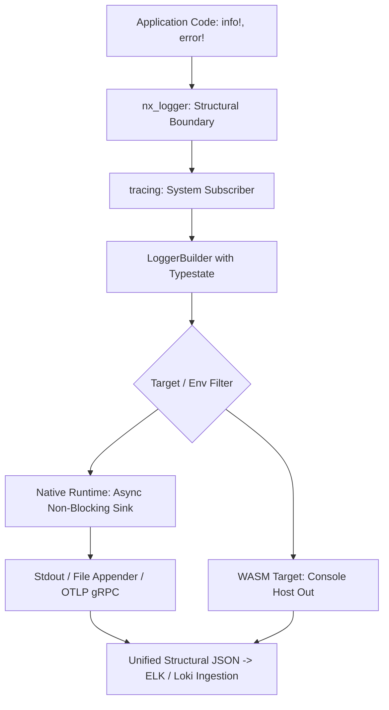

# Observability as a Contract: Why logging was the second crate in NEXUS

## Designing a unified, practically allocation-free, and schema-enforced logging subsystem that bridges the gap between WebAssembly guest components, multithreaded native microservices, and ELK/Loki dashboards.

In a previous post, I discussed why the NEXUS ecosystem prioritized the development of `nx-error` before writing a
single line of core runtime or networking logic. Errors define the deterministic failure boundaries between distributed
components.

But establishing a clear failure contract is only half the battle. Once a distributed system transitions into
production-composed of isolated microservices, CLI utilities, and frontend runtimes - its internal behavior becomes a
complete black box unless it is continuously and predictably observable.

Left unchecked, logging inevitably devolves into a chaotic "zoo" of mismatched formats, disparate timestamps, and
floating schemas. Allowing different crates or modules to dictate their own log structures shifts a massive technical
debt onto DevOps. Instead of analyzing system health during an outage, engineers waste critical hours patching ingestion
pipelines, fixing Elasticsearch mapping crashes, and hunting down dropped telemetry.

To halt this architectural drift before it could even start, I introduced the second foundational crate of
ecosystem: `nx-logger`.



`nx-logger` isn't an attempt to reinvent the wheel. It is designed as an optimized structural wrapper and configuration
layer around the standard `tracing` and `tracing-subscriber` ecosystem. Its core mission is to enforce a stable data
layout contract for monitoring stacks across highly different execution environments.

## The core constraint: One contract for every runtime

In modern distributed platforms, code does not live in an execution monoculture. Within NEXUS, components must run
across three fundamentally different environments:

* **High-throughput native microservices:** Multithreaded backends powered by `tokio` that require lightning-fast
  parallel writing to disk or network sockets.
* **CLI utilities:** Lightweight local binaries running synchronous workflows and piping output directly to stdout.
* **WebAssembly guest modules:** Sandbox modules (`wasm32-unknown-unknown` or WASI) executing inside server runtimes
  like **Wasmtime** or **Spin**. These environments lack direct access to the host's file system, system clock,
  threading models, or raw network sockets.

When these diverse systems send logs to a centralized aggregator, the operational team must be able to parse them using
a single, rock-solid schema contract.

If an async gateway logs a `user_id` as an integer (`42`), but an isolated WASM analytics module logs it as a string (
`"42"`), indexers like Elasticsearch will immediately drop the log due to a mapping conflict. In production, these
conflicts are a nightmare. They don't just happen because of `long` vs `text` mismatches; they trigger on nested object
shape changes, array type collisions, and date parsing discrepancies. When a schema conflict occurs, the ingestion
pipeline might drop the entire batch of logs, wiping out system visibility when you need it most.

`nx-logger` solves this by locking down serialization boundaries inside the application's tracing layer, hiding
environment differences while enforcing a stable text/JSON output layout.

## The API: Compile-time constraints via Typestate

An infrastructure contract is useless if developers can easily misconfigure it or forget to initialize a critical
component. To prevent invalid configurations from reaching production, my builder API leverages the
**Typestate pattern**. By tracking initialization states directly within Rust’s type system, configuration errors are
caught at compile time rather than causing runtime failures.

Developers across the entire workspace interact with a unified initialization flow:

```rust
use nx_logger::{LevelFilter, Logger, Rotation};

fn main() -> Result<(), Box<dyn std::error::Error>> {
    // The Typestate pattern enforces valid configuration at compile time
    let _guard = Logger::builder()
        .name("nx-service")
        .console(false)
        .opentelemetry(true)
        .path("/var/log/nexus")
        .rotation(Rotation::DAILY)
        .max_files(30)
        .level(LevelFilter::DEBUG)
        .init()?; // Registers the global subscriber and returns a RAII guard

    // Unified structured log event
    tracing::info!(
        user_id = 1042, 
        action = "database_init", 
        environment = "production",
        "Establishing persistent database connection pool"
    );

    Ok(())
}
```

### Architectural adaptations under the hood:

* **Native vs. WASM separation:** On native platforms, `nx-logger` integrates with
  `tracing_appender::non_blocking::NonBlocking` to offload I/O operations to a dedicated background thread with file
  rotation capabilities. When compiling for `target_arch = "wasm32"`, the file rotation and background threading code
  are stripped out via conditional compilation (`#[cfg]`). Depending on the specific WebAssembly sub-target, the builder
  transparently redirects events: it bridges directly to `web_sys::console::log` for browser environments, or streams
  directly into the host's native telemetry via standard `wasi:cli/stdout` or `wasi:logging` interfaces for WASI P2
  components, preserving the exact same JSON field layout across all environments.
* **RAII worker guard:** The `init()` method returns a critical resource management guard. As long as this guard remains
  alive in `main()`, logs are processed asynchronously. When the application exits, the guard is dropped, triggering a
  blocking flush that ensures no buffered logs are lost during a sudden shutdown.

## Hot-path optimization: Keeping the heap clean

Every `info!` or `error!` invocation inside critical paths—like high-frequency trading loops or routing engines—can
potentially trigger a lock on the global memory allocator. If a logging utility allocates heap memory for every single
attribute, key, or dynamic string, it quickly introduces thread contention and performance degradation.

To minimize this overhead, `nx-logger` avoids general-purpose serializers like `serde_json` on the execution hot-path,
relying instead on pre-allocated stack arrays and strict limits.

### 1. Bounded paths with `SmallVec` and `SmolStr`

When an application triggers a log event, tracing passes metadata through its internal visitor pattern. Instead of
allocating a `BTreeMap` or a dynamic `Vec` on the heap to collect these fields, `nx-logger` stores them temporarily on
the stack using a `SmallVec` initialized with a static capacity of **16** fields:

```rust
#[derive(Debug, Clone)]
pub(crate) enum FieldValue {
    Static(&'static str),
    String(SmolStr),
    I64(i64),
    U64(u64),
    F64(f64),
    Bool(bool),
}

pub(crate) struct FieldVisitor<'a> {
    pub(crate) attrs: &'a mut SmallVec<(&'static str, FieldValue), 16>,
    pub(crate) ignored: &'a IgnoreFields,
}
```

* **The spillover trade-off:** For 99% of normal log events, 16 metadata slots are more than enough. In these standard
  scenarios, field collection occurs with zero heap allocations. However, real-world telemetry is unpredictable. If a
  deep execution context exceeds 16 fields, `SmallVec` automatically spills over into a dynamic heap allocation. This
  design trade-off favors absolute application stability over pure performance limits under extreme conditions.
* **Inline strings:** Dynamic string values are captured using `SmolStr`. Any string data up to 22 bytes is packed
  directly inside the inline structure on the stack, completely skipping the global allocator.

### 2. Direct streaming via `fmt::Write`

Instead of creating intermediate data structures to represent the log event, `nx-logger` formats and escapes the final
JSON payload directly into the target byte buffer in a single pass using a fast, customized character-matching loop:

```rust
fn write_escaped_json_str(writer: &mut impl std::fmt::Write, s: &str) -> std::fmt::Result {
    writer.write_char('"')?;
    for c in s.chars() {
        match c {
            '"' => writer.write_str("\\\"")?,
            '\\' => writer.write_str("\\\\")?,
            '\n' => writer.write_str("\\n")?,
            '\r' => writer.write_str("\\r")?,
            '\t' => writer.write_str("\\t")?,
            c if c.is_control() => write!(writer, "\\u{:04x}", c as u32)?,
            c => writer.write_char(c)?,
        }
    }
    writer.write_char('"')
}
```

This ensures single-pass formatting, pushing the raw text output straight to the non-blocking file or console appender
without creating short-lived temporary strings on the heap.

## Empirical analysis: Benchmarks and memory profiling

To validate architecture, I tested the subsystem under heavy loads using `criterion` for release-mode latency
measurements and `dhat` for exact heap allocation tracking.

### 1. Latency under contention (Criterion)

The benchmarks were executed in `release` mode to measure the total time spent capturing structured log events
containing a mix of static literals and dynamic fields. I tested the system under varying thread concurrency levels
(1, 4, and 8 workers):

```text
concurrent_logging/workers_1
                        time:   [2.8930 µs 2.9691 µs 3.0433 µs]
concurrent_logging/workers_4
                        time:   [7.8547 µs 7.9639 µs 8.0743 µs]
concurrent_logging/workers_8
                        time:   [11.281 µs 11.354 µs 11.430 µs]
```

**Performance Breakdown:** In a single-threaded environment (`workers_1`), processing and dispatching a structured event
takes roughly **2.97 µs**. As I scale to concurrent multithreaded execution (`workers_4` and `workers_8`), latency
increases to **7.96 µs** and **11.35 µs**. This is an expected architectural trade-off: latency grows due to thread
contention inside the shared non-blocking buffers of `tracing_appender` and the internal shard synchronization routines
of the underlying `sharded_slab` registry.

### 2. Allocation tracking via DHAT

Running logging workloads inside the `dhat` memory profiler reveals the exact global allocation footprints:

```text
dhat: Total Allocations: 17 blocks, 137,344 bytes
dhat: Max Heap Churn:    137,344 bytes
```

Inspecting the generated report call graph pinpoints exactly where these bytes are allocated:

```json
[
  {
    "tb": 32768,
    "fs": [
      "sharded_slab::shard::Array::new",
      "sharded_slab::pool::Pool::new",
      "tracing_subscriber::registry::sharded::Registry"
    ]
  },
  {
    "tb": 102000,
    "fs": [
      "hashbrown::raw::RawTableInner::resize_inner",
      "hashbrown::map::HashMap::insert",
      "nx_logger::utils::IgnoreFields::from_env"
    ]
  }
]
```

**The profiler's verdict:** All 17 allocation blocks (~137 KB) occur exclusively during the system's startup phase
(`LoggerBuilder::init`).

Crucially, on the execution hot-path, calling `info!` or `error!` within the `SmallVec` field limits results in exactly
zero new heap allocations, completely isolating the system from allocator locks during production spikes.

## Honest engineering trade-offs and system limits

High-performance infrastructure design requires making conscious compromises. Gaining fine-grained control over
serialization layouts and memory footprint introduces specific operational risks.

### 1. Manual JSON streaming vs. maintainability

The primary cost of bypassing standard frameworks like `serde_json` is code fragility. During early development, minor
formatting bugs easily generated malformed JSON records:

`Invalid JSON line: {... "spans":[user_login] ...}: Error("expected value")`

Because the log output is built manually using raw string writes, an omitted quote or a misplaced comma will invalidate
the entire JSON string line. Downstream collection systems like Grafana Loki or Logstash will reject the entire
malformed packet.

> **Mitigation Strategy:** To counteract this without adding runtime overhead, I use property-based testing. I
> integrated the `proptest` crate to generate random, highly volatile Unicode strings. These strings are streamed
> through `write_escaped_json_str` function and validated against an exact `serde_json::from_str` reference model,
> catching formatting regressions before release compilation.

### 2. The `fxhash` security boundaries

To meet compliance requirements regarding sensitive user data, `nx-logger` automatically checks log fields against a
redaction blocklist read from the `LOG_IGNORE_FIELDS` environment variable:

```rust
pub(crate) fn from_env() -> Self {
    let names = std::env::var("LOG_IGNORE_FIELDS")
        .unwrap_or_else(|_| "password,token,secret,authorization".to_owned())
        .split(',')
        .map(|s| s.trim().to_lowercase())
        .collect::<FxHashSet<_>>();

    Self { names: Arc::new(names) }
}
```

* **The HashDoS trade-off:** By default, Rust’s standard `HashSet` uses the `SipHash` algorithm to protect against
  HashDoS attacks (where an attacker crafts specific inputs to cause hash collisions and degrade performance to
  `O(N^2)`. In `nx-logger`, I intentionally swapped this out for `FxHashSet` (powered by `fxhash`), which focuses purely
  on execution speed.
* **Security justification:** While `fxhash` is not cryptographically secure, the redaction blocklist is populated
  exclusively at application startup from a trusted environment layer managed by DevOps. Because arbitrary user input
  cannot dynamically inject new keys into this static evaluation set, the vector for HashDoS is completely mitigated,
  making the performance gain perfectly acceptable.

### 3. Backpressure and the drop-head loss policy

When running under high native loads, `tracing` utilizes a bounded in-memory channel to pass log records to the
background
I/O thread. This boundary protects application memory from growing out of control if the host system's disks become
saturated or experience temporary latency spikes.

* **The drop policy:** When this internal buffer fills up completely, the system activates a drop-head policy. The
  oldest unprocessed log records are evicted from the queue and permanently deleted to make room for incoming events.
* **Operational impact:** This design prioritizes the availability and responsiveness of the core application over
  historical logging telemetry. The service will never stall or crash due to disk delays, but the operations team
  accepts that some log history may be lost during severe I/O bottlenecks.

## When this architecture is overkill

This design was engineered for cross-platform enterprise environments where schema enforceability and highly predictable
memory behaviors are paramount. This system is likely unnecessary if you are building:

1. Simple command-line tools or automation scripts intended for standalone local use.
2. Applications that don't aggregate unstructured telemetry into high-volume indexing engines.

For smaller codebases, the standard out-of-the-box configurations of `tracing-subscriber` offer excellent performance
with significantly less code maintenance.

## Resources

NEXUS Architecture Series: [Read the full series index](../README.md)

Previous Article: [Building NEXUS (Part 1): Errors as Infrastructure](../nx-error/README.md)

Main Repository: [NEXUS Source Code](https://github.com/AnatoliiShliakhto/nexus)

Crate: [nx-logger](https://crates.io/crates/nx-logger)